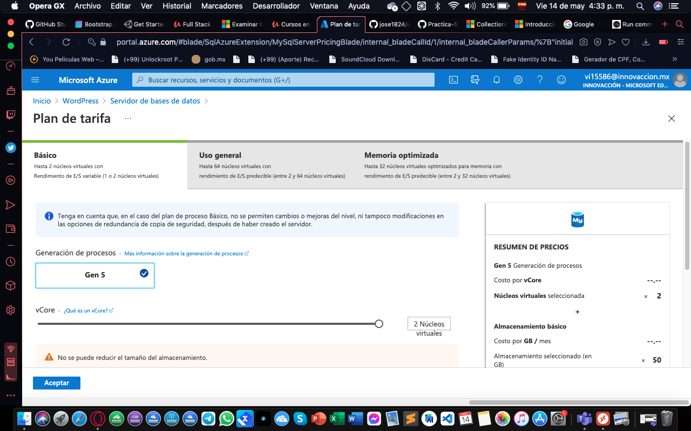

# Practica-Semana-2
Practica

<h1> App Service </h1>

Con Azure App Service puede compilar, implementar y escalar de forma rápida aplicaciones de API, móviles y web de nivel empresarial que se pueden ejecutar en cualquier plataforma. Puede satisfacer los exigentes requisitos de rendimiento, escalabilidad, seguridad y cumplimiento mientras usa una plataforma totalmente administrada para realizar el mantenimiento de la infraestructura. App Service es una oferta de plataforma como servicio (PaaS).

Creacion de Pagina WordPress

Pasos Que Se Utilizo Para La Practica.

1. 🕵️  Primeroes estar en nuestra cuenta iniciada de azure en la ventana de inicio en la barrade busqueda buscamos wordpress.

2. 🕵️. Debemos crear el recurso de wordpress con su grupo de recursos.

3. 🕵️. Crearemos el plan de App Service.

4. 🕵️.  Configuramos el plan de tarifa.

5. 🕵️. Configuramos el plan de mysql.

6. 🕵️. Ya finalizado la configuracion del recurso procederemos a crearlo.

7. 🕵️. Nos mostrara una notificacion que esta implementando el recurso.

8. 🕵️  Nos mostrara una notificacion que finalizo la implementacion del recurso.

9.   🕵️. Nos mostrara un panel para configurar el recurso.
10.  🕵️. Estando iniciado el recurso daremos click en la url del wordpress creado.

11. 🕵️ Configuraremos nuestro wordpress ya estando en linea.

12. 🕵️. Colocamos los datos que nos pide parala instalacion.

13. 🕵️ Debemos recordar el usuario ya que con el podremos acceder al administrador de wordpress para su edicion.

14. 🕵️ Finalizamos la instalacion de wordpress.

Ejemplo De Pagina De WordPress....

  [Siguente](Info.md)
 
