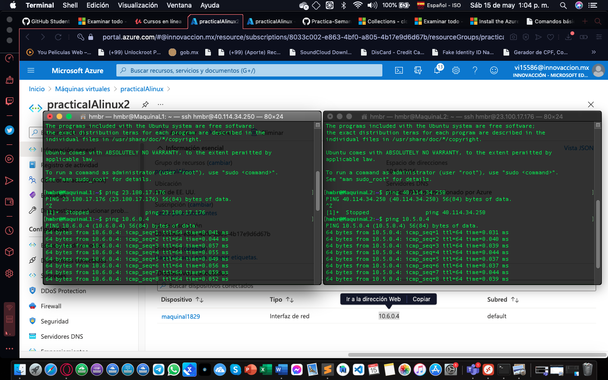
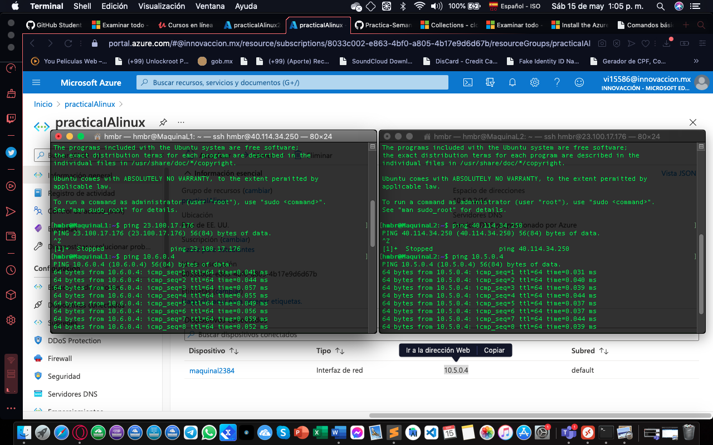

<h1> Practica De Maquina Virtual </h1>
<h1>1. 🐧 primero debemos  crearemos  la maquina virtual.
    Estndo en la ventana de inicio de azure..</h1>

<h1>2. 🐧 Hacemos click en crear la maquina virtual</h1>

<h1>3. 🐧 Colocamos los datos de nuestra maquina virtual
    debemos crear el grupo de recursos para almacenar nuestras maquinas virtuales </h1>

4. 🐧 Configuramos los discos colocamos el disco estandar para nuestras maquinas virtuales.

5. 🐧 Ya todo finalizado la configuacion de nuestra maquina virtual le damos crear y esperamos que se creen nos notificara.

6. 🐧 Ya completado el proceso podemos ir al recurso.

7. 🐧  Probando la conexion en terminal desde una pc.

8. 🐧 probando con dos terminales las conexiones de las maquinas virtuales.

9. 🐧 Haciendo el emparejamiento para poder realizar el ping de maquina a maquina.

10. 🐧. Relizando las pruebas de conexion con sus respectivas direcciones.

