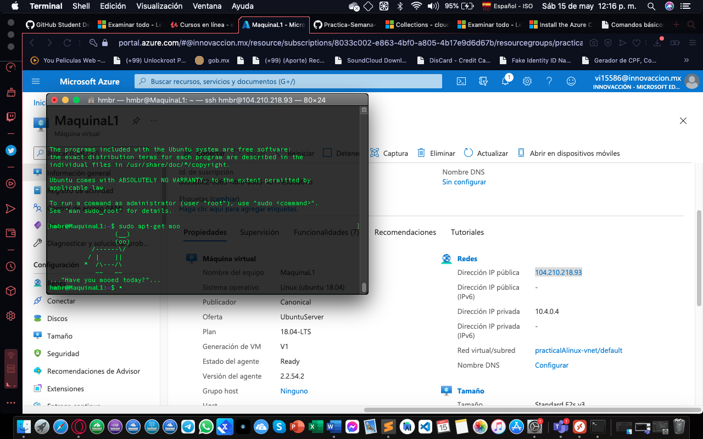
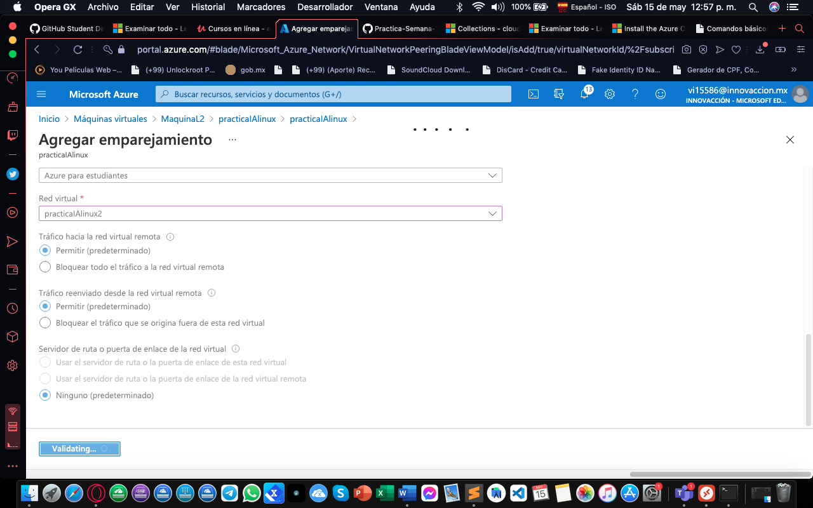

<h1> Practica De Maquina Virtual </h1>
1. 🐧 primero debemos  crearemos  la maquina virtual.
    Estndo en la ventana de inicio de azure..

2. 🐧 Hacemos click en crear la maquina virtual

3. 🐧 Colocamos los datos de nuestra maquina virtual
    debemos crear el grupo de recursos para almacenar nuestras maquinas virtuales

4. 🐧 Configuramos los discos colocamos el disco estandar para nuestras maquinas virtuales.

5. 🐧 Ya todo finalizado la configuacion de nuestra maquina virtual le damos crear y esperamos que se creen nos notificara.

6. 🐧 Ya completado el proceso podemos ir al recurso.

